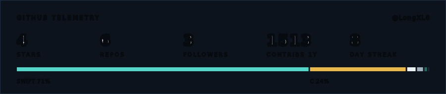

  

I build small hardware and the software around it — 8051 MCUs, WS2812 LED controllers, FPV gear, and indie iOS apps. Based in Los Angeles. More at [LongXL.com](https://www.longxl.com).

**Featured work**

- [LongXL-LED-Open-Source-Version](https://github.com/LongXL6/LongXL-LED-Open-Source-Version) — one-button WS2812 controller on a $0.27 STC8G1K08A (8-pin 8051), bit-banged 800 kHz at 35 MHz IRC
- [Led-Controller-stc8g1k08a](https://github.com/LongXL6/Led-Controller-stc8g1k08a) — super tiny LED controller for FPV quads
- [FPVTrackVote](https://github.com/LongXL6/FPVTrackVote) — Swift app for voting on FPV race tracks

### Stats

  

### Recent activity

<!--START_SECTION:activity-->
1. 🎉 Merged PR [#62](https://github.com/BIBOYANG425/bia-admin/pull/62) in [BIBOYANG425/bia-admin](https://github.com/BIBOYANG425/bia-admin)
2. 💪 Opened PR [#62](https://github.com/BIBOYANG425/bia-admin/pull/62) in [BIBOYANG425/bia-admin](https://github.com/BIBOYANG425/bia-admin)
3. 🎉 Merged PR [#61](https://github.com/BIBOYANG425/bia-admin/pull/61) in [BIBOYANG425/bia-admin](https://github.com/BIBOYANG425/bia-admin)
4. 🎉 Merged PR [#60](https://github.com/BIBOYANG425/bia-admin/pull/60) in [BIBOYANG425/bia-admin](https://github.com/BIBOYANG425/bia-admin)
5. 💪 Opened PR [#61](https://github.com/BIBOYANG425/bia-admin/pull/61) in [BIBOYANG425/bia-admin](https://github.com/BIBOYANG425/bia-admin)
<!--END_SECTION:activity-->

  

