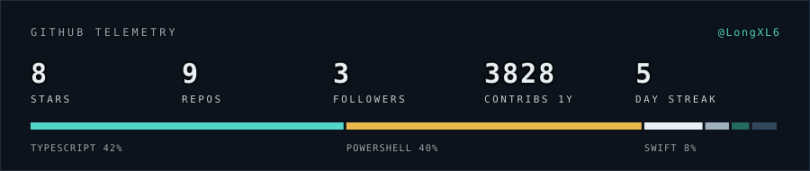

  

I build small hardware and the software around it — 8051 MCUs, WS2812 LED controllers, FPV gear, and indie iOS apps. Based in Los Angeles. More at [LongXL.com](https://www.longxl.com).

**Featured work**

- [LongXL-LED-Open-Source-Version](https://github.com/LongXL6/LongXL-LED-Open-Source-Version) — one-button WS2812 controller on a $0.27 STC8G1K08A (8-pin 8051), bit-banged 800 kHz at 35 MHz IRC
- [Led-Controller-stc8g1k08a](https://github.com/LongXL6/Led-Controller-stc8g1k08a) — super tiny LED controller for FPV quads
- [FPVTrackVote](https://github.com/LongXL6/FPVTrackVote) — Swift app for voting on FPV race tracks

### Stats

  

### Recent activity

<!--START_SECTION:activity-->
1. 🎉 Merged PR [#17](https://github.com/LongXL6/windows-360-cleaner/pull/17) in [LongXL6/windows-360-cleaner](https://github.com/LongXL6/windows-360-cleaner)
2. 🔒 Closed issue [#8](https://github.com/LongXL6/windows-360-cleaner/issues/8) in [LongXL6/windows-360-cleaner](https://github.com/LongXL6/windows-360-cleaner)
3. 🔒 Closed issue [#10](https://github.com/LongXL6/windows-360-cleaner/issues/10) in [LongXL6/windows-360-cleaner](https://github.com/LongXL6/windows-360-cleaner)
4. 🎉 Merged PR [#16](https://github.com/LongXL6/windows-360-cleaner/pull/16) in [LongXL6/windows-360-cleaner](https://github.com/LongXL6/windows-360-cleaner)
5. 🔒 Closed issue [#7](https://github.com/LongXL6/windows-360-cleaner/issues/7) in [LongXL6/windows-360-cleaner](https://github.com/LongXL6/windows-360-cleaner)
<!--END_SECTION:activity-->

  

